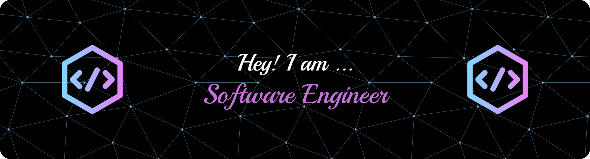

# Hi there, I'm Faith Gbadegbe Etornam! 👋
# 

## About Me 🚀

I'm a passionate **Backend Engineer** with experience in **Django**. I love tackling complex problems, learning new skills, and collaborating with diverse teams to create innovative solutions.

- 🌱 Currently learning: **Django**
- 🔭 Working on: **Pending**
- 🌍 Languages: **JavaScript, TypeScript and Python**
- 📫 How to reach me: **faithgbadegbe1@gmail.com**
- ⚡ Fun fact: **I wanna be Spider-Man😅🤣😅 **
- 😎 Slogan: I will keep going with no trace of the man I'll be tomorrow

## 📫 Let's Connect

I'm always open to discussing backend development, new opportunities, or potential collaborations.

### ALX Backend Web Development | Problem Solver | Future Backend Engineering Expert

## My Skills 🧠

